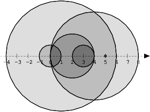

# Number Of Disc Intersections (Easy)

## Task Description

> Reference: [click here](https://app.codility.com/programmers/lessons/6-sorting/number_of_disc_intersections/)

We draw N discs on a plane. The discs are numbered from 0 to N − 1. An array A of N non-negative integers, specifying the radiuses of the discs, is given. The J-th disc is drawn with its center at (J, 0) and radius A[J].

We say that the J-th disc and K-th disc intersect if J ≠ K and the J-th and K-th discs have at least one common point (assuming that the discs contain their borders).

The figure below shows discs drawn for N = 6 and A as follows:

A[0] = 1    
A[1] = 5    
A[2] = 2    
A[3] = 1    
A[4] = 4    
A[5] = 0    




There are eleven (unordered) pairs of discs that intersect, namely:

* discs 1 and 4 intersect, and both intersect with all the other discs;
* disc 2 also intersects with discs 0 and 3.

Write a function:

`class Solution { public int solution(int[] A); }`

that, given an array A describing N discs as explained above, returns the number of (unordered) pairs of intersecting discs. The function should return −1 if the number of intersecting pairs exceeds 10,000,000.

Given array A shown above, the function should return 11, as explained above.

Write an efficient algorithm for the following assumptions:

* N is an integer within the range [0..100,000];
* each element of array A is an integer within the range [0..2,147,483,647].

## Solution

```java
// you can also use imports, for example:
import java.util.*;

// you can write to stdout for debugging purposes, e.g.
// System.out.println("this is a debug message");

class Solution {
  public int solution(int[] A) {
    int N = A.length;
    if (N < 2) return 0; // No pairs possible with less than 2 discs

    // Arrays to store the start and end points of each disc
    long[] start = new long[N];
    long[] end = new long[N];

    for (int i = 0; i < N; i++) {
      start[i] = (long) i - A[i]; // Prevent integer overflow
      end[i] = (long) i + A[i];
    }

    // Sort start and end arrays
    Arrays.sort(start);
    Arrays.sort(end);

    int activeDiscs = 0;
    int intersections = 0;
    int endIndex = 0;

    // Traverse the start array to calculate intersections
    for (int i = 0; i < N; i++) {
      // Add new disc
      activeDiscs++;

      // Check discs that have ended before this one starts
      while (endIndex < N && end[endIndex] < start[i]) {
        activeDiscs--;
        endIndex++;
      }

      // Calculate intersections (excluding the current disc)
      intersections += activeDiscs - 1;

      // Return -1 if intersections exceed 10,000,000
      if (intersections > 10_000_000) {
        return -1;
      }
    }

    return intersections;
  }
}
```